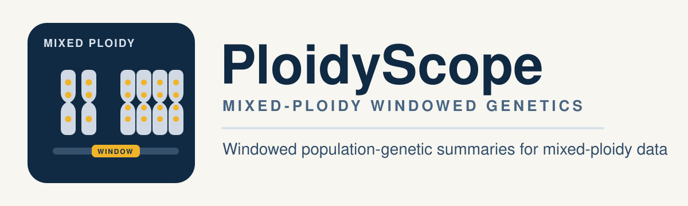

<h1>
  
  PloidyScope
</h1>

<p align="center">
  
</p>

PloidyScope is a small, deterministic Snakemake workflow and Python package for windowed population-genetic summaries on mixed-ploidy genotype data. It is designed as a straightforward implementation with one clean package path and one simple workflow entrypoint.

The codebase is intentionally direct:

- one package: `ploidyscope`
- one statistics namespace: `ploidyscope.stats`
- one table-driven Snakemake workflow
- explicit output tables with raw counts where relevant

## Statistics

PloidyScope currently has two layers of statistics:

- Public CLI and workflow stats: `rho`, `dxy`, `pi`, `tajima_d`, `hudson`
- Internal or validation-only stats/helpers: diploid `wc` fst accumulation inside `rho`, mixed-ploidy `dxy_scantools_mean`, and legacy `bpm`/`wpm` compatibility wrappers

### Public stats

#### `rho`

`rho` is the main mixed-ploidy pairwise statistic in this repository. At each site, PloidyScope:

- groups samples by population
- drops missing genotypes within each population
- converts genotype sums into per-individual allele frequencies based on that population's ploidy
- computes an analysis-of-variance decomposition across populations, individuals, and gametes
- aggregates per-site `rho_num` and `rho_den` within windows

The final windowed value is reported as:

$$
\rho = \frac{\rho_{num} / \rho_{den}}{1 + (\rho_{num} / \rho_{den})}
$$

only when the window has at least `minimum_snps` polymorphic sites and a non-zero denominator.

`rho` is designed for arbitrary ploidy and is the main statistic intended for mixed diploid-tetraploid comparisons.

#### `dxy`

`dxy` is the default pairwise divergence estimator. For each site and each pair of populations, PloidyScope computes:

- `diffs = ref_1 * alt_2 + alt_1 * ref_2`
- `comparisons = observed_alleles_1 * observed_alleles_2`
- `missing = possible_alleles_1 * possible_alleles_2 - comparisons`

Windowed `avg_dxy` is then the weighted ratio:

$$
d_{xy} = \frac{\sum diffs}{\sum comparisons}
$$

This is the main internal `dxy` reported by the CLI and workflow.

#### `pi`

`pi` is within-population diversity. At each site, PloidyScope computes the number of alternate-reference allele pairs among observed alleles within a population and divides by the number of pairwise allele comparisons. Windowed `pi` is:

$$
\pi = \frac{\sum diffs}{\sum comparisons}
$$

with `count_missing` derived from the difference between possible and observed pairwise allele comparisons.

#### `tajima_d`

`tajima_d` is computed per population per window from:

- `raw_pi`: the sum of sitewise within-population diversity values over observed sites
- `raw_watterson_theta`: the sum of $1 / a_1$ over variant sites, where $a_1$ is the harmonic number of the observed allele count at that site
- `tajima_d_stdev`: the window-level denominator based on the effective sample size convention described below

The implementation uses raw $\pi$ and raw Watterson's $\theta$ in the numerator, and matches pixy's current denominator convention as closely as possible for fixture comparison. In practice, pixy computes the effective sample size for the Tajima denominator from the mean allele count across all sites in the window, including sites where a population has zero observed alleles because all genotypes are missing. Pixy also emits `0.0` for `tajima_d_stdev` when there are observed sites but the denominator collapses to zero, and emits `NA` when a window effectively has no usable observations. PloidyScope previously used the mean allele count only across sites with observed alleles in the window, which is arguably the cleaner statistical choice because fully missing sites do not dilute the effective sample size. I still think that older behavior is the better default in principle, because it reflects the observed data more directly, but the current code follows pixy instead so that validation against pixy is exact on shared windows. This should be rechecked if pixy updates its Tajima's D logic in the future.

#### `hudson`

`hudson` is a public pairwise same-ploidy fst stat. At each site, PloidyScope computes a Hudson/Bhatia-style numerator and denominator from the two populations' observed alternate-allele frequencies and observed allele counts, then aggregates windows as:

$$
F_{ST}^{Hudson} = \frac{\sum numerator}{\sum denominator}
$$

over sites with positive denominators. The output keeps both the aggregated numerator and denominator and reports `avg_hudson_fst` only when the window has at least `minimum_snps` valid sites. This implementation supports same-ploidy comparisons generally, including tetraploid pairs, and is the public fst stat currently exposed by the CLI and workflow.

### Internal and validation-only stats

#### Diploid `wc` fst

PloidyScope does not expose `wc` fst as a standalone CLI stat, but windowed `fst` components are carried inside the `rho` machinery and used in validation. For diploid population pairs, the code now uses a direct Weir-Cockerham-style per-site decomposition that mirrors pixy's scikit-allel window semantics:

- compute diploid allele counts per population from observed genotypes only
- compute Weir-Cockerham `a`, `b`, and `c` terms per site
- aggregate windows as `sum(a) / (sum(a) + sum(b) + sum(c))` using separate `nansum` handling for the three terms

This matters for sparse diploid sites where `a` and `b` are undefined but `c` is finite. PloidyScope now keeps those denominator contributions the same way pixy does. For non-diploid pairs, the `fst_num` and `fst_den` fields still come from the same ANOVA path used for `rho`.

#### Mixed-ploidy `dxy_scantools_mean`

`calc_dxy_windows_scantools_mean()` exists specifically to mirror ScanTools BPM's site-mean behavior for mixed-ploidy validation. Unlike the main weighted `dxy`, it computes per-site `dxy = diffs / comparisons` first and then averages those site values unweighted within a window.

Use this only when reproducing ScanTools-style benchmark outputs. The public CLI `dxy` remains the weighted estimator above.

#### Legacy wrappers: `bpm` and `wpm`

The `ploidyscope.stats.bpm` and `ploidyscope.stats.wpm` modules are compatibility helpers for older between-population and within-population table layouts. They are thin wrappers over the main implementations:

- `bpm` repackages `rho` and weighted `dxy` into legacy ScanTools-like columns
- `wpm` repackages `pi`, `raw_pi`, `raw_watterson_theta`, and `tajima_d` into legacy within-population summary columns

They are not the primary user-facing API.

## Input format

PloidyScope can read either a VCF plus a population map, or a recoded table.

### VCF mode

Use:

```text
input_vcf: path/to/input.vcf.gz
population_map: path/to/populations.tsv
```

The population map must contain at least two columns:

```text
sample    population
```

The VCF loader groups samples by population, infers ploidy from the genotype field, and aggregates per-population allele counts at each site. At the moment, multi-allelic sites are skipped and each population is expected to have a consistent ploidy at a given site.

### Table mode

The recoded table layout is:

```text
pop    ploidy    chromosome    position    an    dp    genotype_1    genotype_2    ...
```

`genotype_*` values are per-individual alternate-allele counts. Missing genotypes must be encoded as `-9`.

The VCF entrypoint is the recommended mode for normal use. Table mode remains available for debugging, testing, or custom preprocessing.

## Snakemake usage

Set either `input_vcf` plus `population_map`, or `input_table`, together with `stats` in `config.yaml`, then run:

```bash
snakemake -n -p
snakemake --cores 4
```

By default the example config only requests `rho`, which keeps the workflow focused on the mixed-ploidy statistic most likely to need a dedicated run.

## CLI usage

You can run any single stat directly without Snakemake:

```bash
python -m ploidyscope.stats.cli \
  --stat rho \
  --vcf data/example.vcf.gz \
  --popmap data/populations.tsv \
  --out results/ploidyscope/rho.tsv \
  --window-size 100000 \
  --minimum-snps 2
```

Supported `--stat` values are `rho`, `dxy`, `pi`, `tajima_d`, and `hudson`. For direct table input, replace `--vcf ... --popmap ...` with `--infile data/example.recoded.tsv`.

## Output tables

`rho.tsv`

```text
pop1    pop2    chromosome    window_pos_1    window_pos_2    rho    no_sites    no_snps    rho_num    rho_den    fst_num    fst_den    fst_no_snps
```

`dxy.tsv`

```text
pop1    pop2    chromosome    window_pos_1    window_pos_2    avg_dxy    no_sites    count_diffs    count_comparisons    count_missing
```

`pi.tsv`

```text
pop    chromosome    window_pos_1    window_pos_2    pi    no_sites    count_diffs    count_comparisons    count_missing
```

`tajima_d.tsv`

```text
pop    chromosome    window_pos_1    window_pos_2    tajima_d    no_sites    raw_pi    raw_watterson_theta    tajima_d_stdev
```

`hudson.tsv`

```text
pop1    pop2    chromosome    window_pos_1    window_pos_2    avg_hudson_fst    no_sites    no_snps    hudson_num    hudson_den
```

## Polyploid notes

- `rho` is the most specialized part of the codebase, because it is intended specifically for mixed-ploidy comparisons.
- `dxy` and `pi` are computed from allele-count differences/comparisons, which extend naturally to arbitrary ploidy as long as the recoded table contains alternate-allele counts per individual.
- `tajima_d` is provided for polyploid recoded tables, but it should still be treated as a practical approximation under missing data rather than a final theoretical solution.
- Tajima's D is intentionally matched to pixy's current implementation for comparison purposes. Concretely, that means the denominator uses pixy's mean-all-sites sample-size convention, including zero-observation sites, and mirrors pixy's `0.0` versus `NA` handling for `tajima_d_stdev` in sparse windows. Before this compatibility change, PloidyScope used only the mean allele count across observed sites, which is probably the more defensible statistical default but did not reproduce pixy's output exactly. Recheck this behavior if pixy changes upstream.

## Testing

From the repository root:

```bash
python -m pytest tests -q
```

Keep the regular test suite small and reviewable:

- keep test code in `tests/test_stats.py` and lightweight helpers such as `tests/run_quickcheck.py`
- keep only small hand-authored fixtures or tiny synthetic inputs that are directly required by unit tests
- keep the canonical validation fixture input VCF and metadata under `tests/data/fixture_comparison/fixture/`, because users cannot recreate that sampling step from the public test suite alone
- ignore regenerated baseline-comparison outputs under `tests/data/fixture_comparison/`, because those files are rebuilt by the comparison helper and are not consumed by the unit tests

The extractor itself is now generic by default: you provide the source VCF, metadata, region, and selected populations explicitly. The checked-in validation fixture is just one concrete invocation of that generic extractor.

For the checked-in 10 Mb validation fixture, rebuild the fixture inputs with:

```bash
make extract-real-fixture
```

This make target passes the canonical source VCF, metadata, region, output prefix, and population set explicitly to the generic extractor, and writes the fixture under [tests/data/fixture_comparison/fixture](/data/users/rchoudhury/PloidyScope/tests/data/fixture_comparison/fixture).

The checked-in make targets run through [.tool-baselines/pixy-venv/bin/python](/data/users/rchoudhury/PloidyScope/.tool-baselines/pixy-venv/bin/python) so the fixture helpers have `pysam` and the same baseline-tool environment used by the comparison step.

Then rerun the baseline comparisons on the existing fixture with:

```bash
make compare-real-fixture
```

If you want the convenience target that chains both steps, run:

```bash
make compare-canonical-fixture
```

Regeneration policy for [tests/data/fixture_comparison](/data/users/rchoudhury/PloidyScope/tests/data/fixture_comparison):

- keep `fixture/comparison_fixture.vcf.gz`, `fixture/comparison_fixture.vcf.gz.tbi`, and `fixture/comparison_fixture_metadata.tsv` versioned as the permanent shared input fixture
- `fixture/comparison_map.tsv` and `fixture/comparison_fixture_popmap.tsv` are helper files that can be regenerated and stay ignored by default
- `pixy/`, `ploidyscope/`, and `scantools/` are generated outputs and should stay ignored
- `summary.json`, `summary.tsv`, `visual_summary.md`, and `visual_summary.svg` are also regenerated reports and should stay ignored
- if you need to inspect a fresh comparison run, regenerate locally and review the files in place without committing them by default
- if the fixture definition changes and you intentionally want to refresh the committed VCF or metadata, make that an explicit decision rather than the default workflow

Generic extraction example:

```bash
python scripts/extract_fixture_region.py \
  --vcf data/input.vcf.gz \
  --metadata data/metadata.tsv \
  --outdir results/fixture_region \
  --output-prefix fixture_region \
  --region chr1:1-1000000 \
  --selected-pops POP1 POP2 POP3
```

Typical regeneration steps:

```bash
make extract-real-fixture
make compare-real-fixture
python -m pytest tests -q
```

If you need to prepare a fixture from another VCF while iterating on the comparison helper, run:

```bash
python scripts/extract_fixture_region.py \
  --vcf /path/to/input.vcf.gz \
  --metadata /path/to/metadata.tsv \
  --outdir /tmp/ploidyscope-fixture \
  --output-prefix custom_region \
  --region chr1:1-10000000 \
  --selected-pops POP1 POP2 POP3 POP4
```

The metadata only needs sample, population, and ploidy columns; `serpentine` remains optional and defaults to `unknown` for non-serpentine inputs.

Then point the comparison helper at the extracted fixture instead of the source VCF:

```bash
python scripts/compare_real_fixture.py \
  --outdir /tmp/ploidyscope-fixture-check \
  --fixture-vcf /tmp/ploidyscope-fixture/custom_region.vcf.gz \
  --metadata /tmp/ploidyscope-fixture/custom_region_metadata.tsv \
  --fixture-popmap /tmp/ploidyscope-fixture/custom_region_popmap.tsv \
  --comparison-map /tmp/ploidyscope-fixture/comparison_map.tsv
```

That is the safer default when debugging because the comparison helper now only deletes and recreates generated baseline outputs, not the fixture directory itself.

In practice, that means the permanent fixture inputs should only change when you intentionally refresh the canonical sampled dataset for users. Normal validation or compatibility work should rerun the compare step without changing the committed fixture files.

The comparison is intentionally routed by ploidy relationship:

- within-population and same-ploidy pairwise comparisons are checked against pixy after splitting the fixture by ploidy
- mixed-ploidy population pairs are recoded into strict ScanTools-style tables and checked against original ScanTools BPM in 10 kb windows

The generated fixture includes a comparison map that records whether each pair was routed to `pixy` or `scantools`. `wc` fst is only used for diploid pixy comparisons, matching pixy's own restriction in version `2.0.0.beta14`. For that diploid `wc` benchmark, the fixture gives pixy a second VCF filtered to the same record class that PloidyScope's VCF loader actually uses: biallelic single-base sites plus invariant single-base records, with multiallelic sites and indels removed. The internal diploid WC accumulation now also follows pixy's windowed scikit-allel semantics directly, namely `sum(a) / (sum(a) + sum(b) + sum(c))` with separate `nansum` handling of the three Weir-Cockerham variance components across sites. That matters in sparse diploid edge cases where `a` and `b` are undefined but `c` is finite, because pixy keeps that `c` contribution in the denominator. Fixture comparison for diploid `wc` therefore uses the filtered VCF plus non-`NA` windows on both sides, so the shared-window benchmark is exact by construction. Public `hudson` fst is compared against pixy's `hudson` output on same-ploidy splits, including tetraploid pairs. Mixed-ploidy ScanTools comparisons are normalized onto the same 1-based 10 kb window coordinates before summary comparison.

## Citation

If you use PloidyScope, cite it as:

```text
Choudhury, R. R. (2025). PloidyScope.
```

BibTeX:

```bibtex
@misc{choudhury_ploidyscope_2025,
  author = {Choudhury, R. R.},
  title = {PloidyScope},
  year = {2025}
}
```

